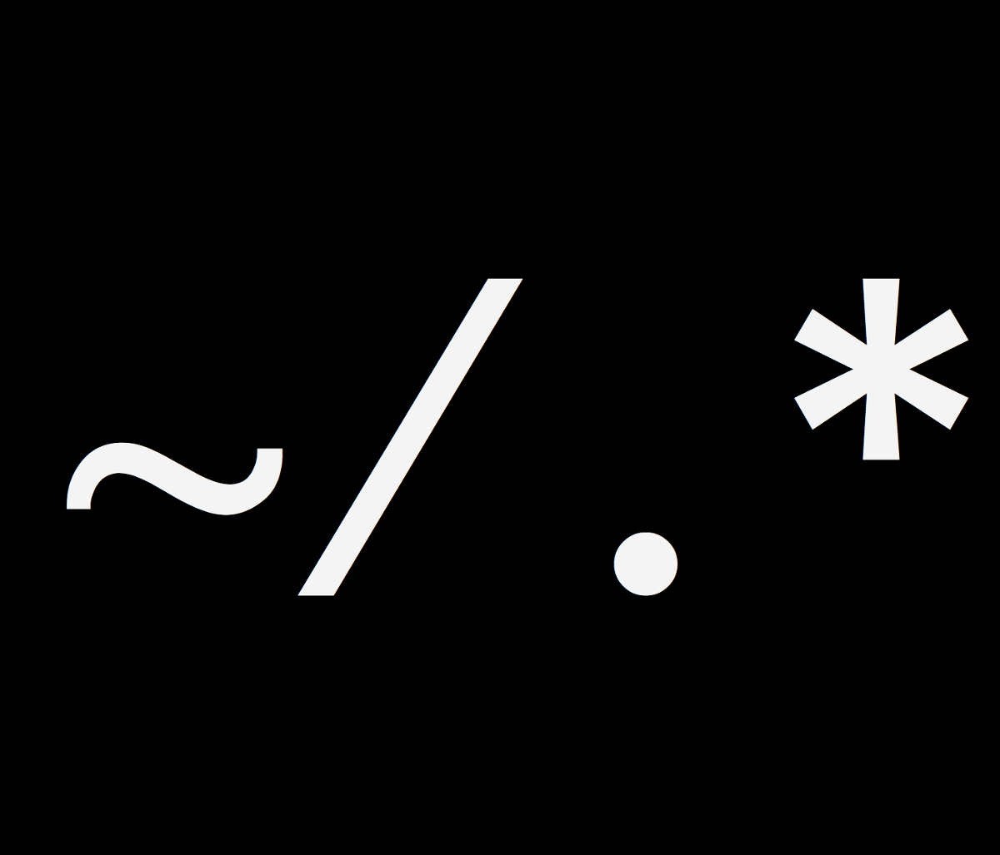
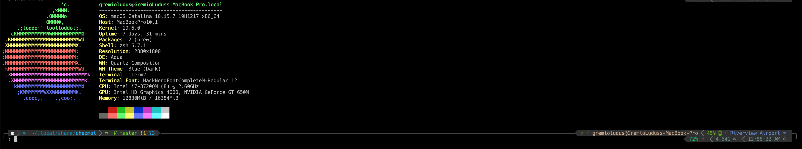
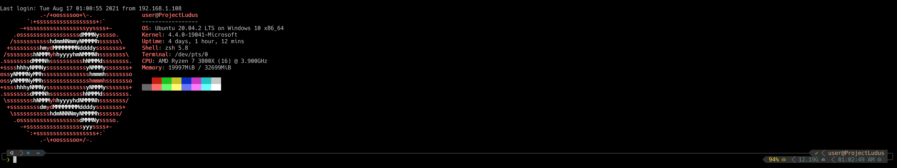
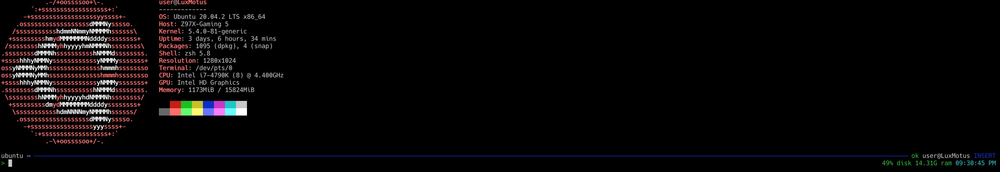

<!-- PROJECT SHIELDS -->
[![Contributors][contributors-shield]][contributors-url]
[![Forks][forks-shield]][forks-url]
[![Stargazers][stars-shield]][stars-url]
[![Issues][issues-shield]][issues-url]

<!-- PROJECT LOGO -->
<br />
<p align="center">
  <a href="https://github.com/PartemImperium/dotfiles">
    
  </a>

  <h3 align="center">dotfiles</h3>

  <p align="center">A single source for all my dotfiles to be applied to my machines.<br /></p>
</p>

<!-- TABLE OF CONTENTS -->
<details open="open">
  <summary><h2 style="display: inline-block">Table of Contents</h2></summary>
  <ol>
    <li>
      <a href="#about-the-project">About The Project</a>
      <ul>
        <li><a href="#built-with">Built With</a></li>
        <li><a href="#installed-zsh-modules">Installed zsh Modules</a></li>
        <li><a href="#other-installed-tools">Other installed tools</a></li>
      </ul>
    </li>
    <li>
      <a href="#getting-started">Getting Started</a>
      <ul>
        <li><a href="#prerequisites">Prerequisites</a></li>
        <li><a href="#installation">Installation</a></li>
      </ul>
    </li>
    <li><a href="#test-it-out">Test it Out</a></li>
    <li><a href="#making-changes">Making Changes</a></li>
    <li><a href="#screenshots">Screenshots</a></li>
    <li><a href="#acknowledgements">Acknowledgements</a></li>
  </ol>
</details>

<!-- ABOUT THE PROJECT -->
## About The Project
A single source for all my dotfiles to be applied to my machines. These will be applied with [chezmoi](https://github.com/twpayne/chezmoi).


### Built With

* [chezmoi](https://github.com/twpayne/chezmoi) - dotfiles manager
* [zsh](https://www.zsh.org/) - my perfered shell
* [zit](https://github.com/thiagokokada/zit) - minimal zsh module manager

### Installed zsh modules
* [powerline10k](https://github.com/romkatv/powerlevel10k) - zsh theme
* [zsh-autocomplete](https://github.com/marlonrichert/zsh-autocomplete.git) - auto complete on steroids.
* [git-it-on](https://github.com/peterhurford/git-it-on.zsh) - Commands to open github/gitlab from your working directory (when it is a git repo).
* [fast-syntax-highlighting](https://github.com/zdharma/fast-syntax-highlighting) - Customizible syntax highlighting.

### Other installed tools
* [neoFetch](https://github.com/dylanaraps/neofetch) - Shows system info with cool ascii art for your distro on login.
* My [aliases](dot_aliases) - My personal aliases for zsh (should work in bash as well)
* My [functions](dot_functions) - My personal functions for zsh. *.zsh gets loaded and compiled.

### Configurations managed
* .zshrc
* .p10k.zsh
* .gitconfig
  * Creates a .HOSTNAME.gitignore file and imports it allowing you to put things that you dont want on github in your config (work git info).
<!-- GETTING STARTED -->
## Getting Started

To get a local machine up and running with these dotfiles follow these simple steps.

### Prerequisites

The following things will be needed to use theses dotfiles.
* curl - Used to download the [chezmoi](https://github.com/twpayne/chezmoi) installer.
* zsh - My perfered shell
* bash - Needed by [neoFetch](https://github.com/dylanaraps/neofetch).
* A installed [nerdfont](https://github.com/ryanoasis/nerd-fonts)
  * I use the patched Hack font but any of the patched fonts from that repo will work.
  * You will need to set it as the font for your terminal emulator.
  * Eventually I will manage the fonts with this repo but havent figured out how to get it to work with linux, macos and windows.
  * If you dont install a patched nerd font things will function but there will be missing chars in the terminal theme making it look weird.

### Installation

This installs [chezmoi](https://github.com/twpayne/chezmoi), sets it up to use this repo for dotfiles and applies them to your user.
```zsh
sh -c "$(curl -fsLS git.io/chezmoi)" -- init --apply PartemImperium 
```

## Test it Out
If you want to try out before running it on your machine you can use one of the following docker containers to see what it will do. As soon as you exit out of the container it will stop and all changes will be reverted.

You can use whichever base image you perfer (any base image will do but I have examples for both Alpine and Ubuntu). The below commands start the docker container in a interactive colorized terminal (and auto installs/updates the needed tools) that self destructs when you exit the container.

### Alpine
```zsh
docker run -e TERM -e COLORTERM -it --rm alpine sh -uec '
  apk update
  apk add git zsh nano curl bash
  exec zsh'
```

### Ubuntu
```zsh
docker run -e TERM -e COLORTERM -it --rm ubuntu sh -uec '
  apt-get update
  apt-get install git zsh nano curl bash
  exec zsh'
```
After you are in the interactive docker container run the command from the [installation instructions](#installation) to apply the files. After that finishes to see the effect of the dotfiles you will have to launch a new instance of zsh 
```zsh
zsh
```
or source the .zshrc file if you already in a zsh shell
```zsh
source ~/.zshrc
```
## Making Changes
To make changes I make the changes in a new branch and then run them in a docker container as explained in [Test it Out](#test-it-out) with a slight modification to the instalation command that checks out a specifc branch instead of the default master branch.
```zsh
sh -c "$(curl -fsLS git.io/chezmoi)" -- init --apply PartemImperium --branch feature/my-super-awesome-addition
```
Once I verify everything works in the docker container merge the branch into master and update on machinces.
```zsh
chezmoi update
```

## Screenshots

### macos


### Ubuntu (WSL)


### Ubuntu Terminal
In the default terminal when only 8 colors exist (and icon fonts wont work) the theme reacts and still shows all the same data (just a little less flashy). The screenshot was taken in a normal terminal emulator specifying it was the default terminal so neoFetch still shows 16 colors.


<!-- ACKNOWLEDGEMENTS -->
## Acknowledgements

* Example chezmoi dotfile repo's
    * [GitHub](https://github.com/topics/chezmoi?o=desc&s=updated)
    * [GitLab](https://gitlab.com/search?search=chezmoi)
* [Good starter readme](https://github.com/othneildrew/Best-README-Template)

<!-- MARKDOWN LINKS & IMAGES -->
<!-- https://www.markdownguide.org/basic-syntax/#reference-style-links -->
[contributors-shield]: https://img.shields.io/github/contributors/PartemImperium/dotfiles.svg?style=for-the-badge
[contributors-url]: https://github.com/PartemImperium/dotfiles/graphs/contributors
[forks-shield]: https://img.shields.io/github/forks/PartemImperium/dotfiles.svg?style=for-the-badge
[forks-url]: https://github.com/PartemImperium/dotfiles/network/members
[stars-shield]: https://img.shields.io/github/stars/PartemImperium/dotfiles.svg?style=for-the-badge
[stars-url]: https://github.com/PartemImperium/dotfiles/stargazers
[issues-shield]: https://img.shields.io/github/issues/PartemImperium/dotfiles.svg?style=for-the-badge
[issues-url]: https://github.com/PartemImperium/dotfiles/issues
